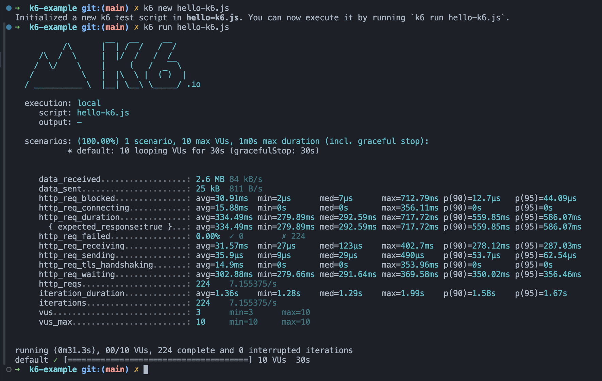
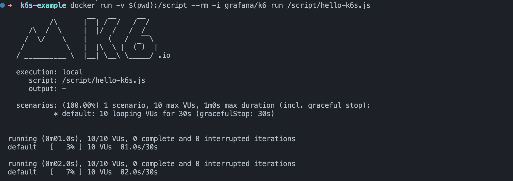
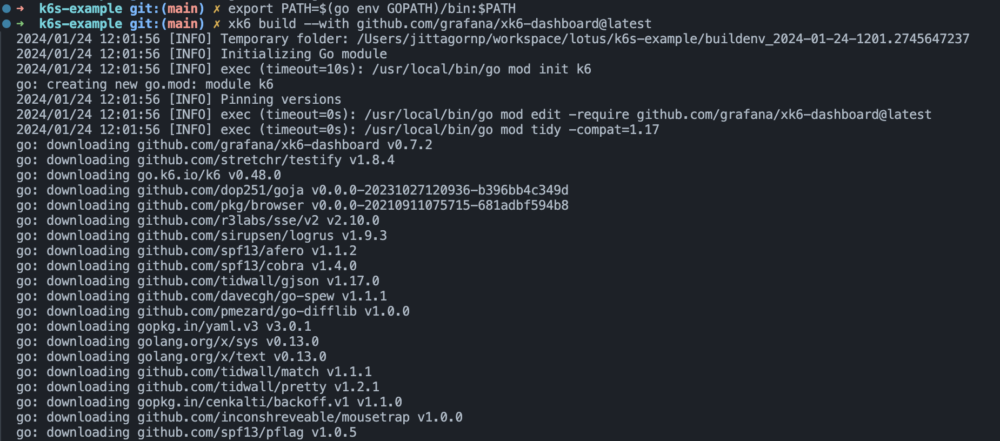
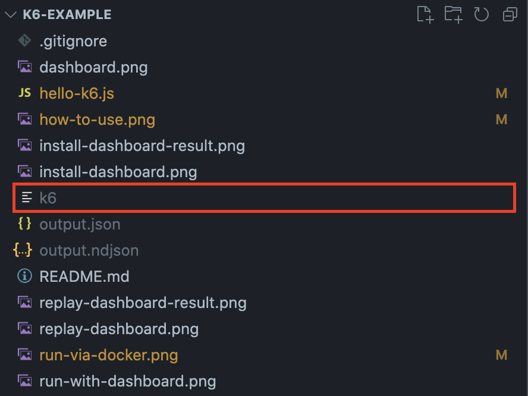
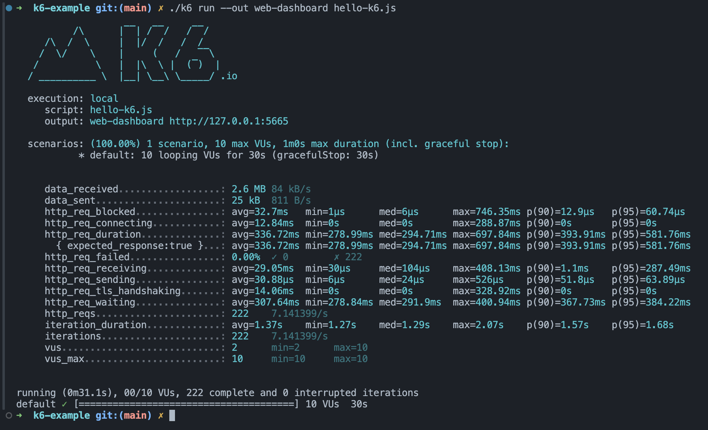
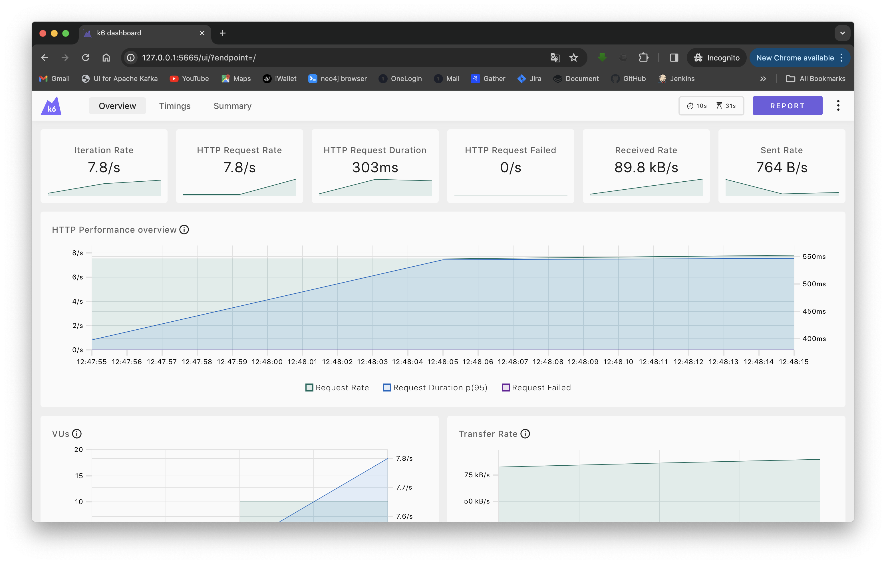
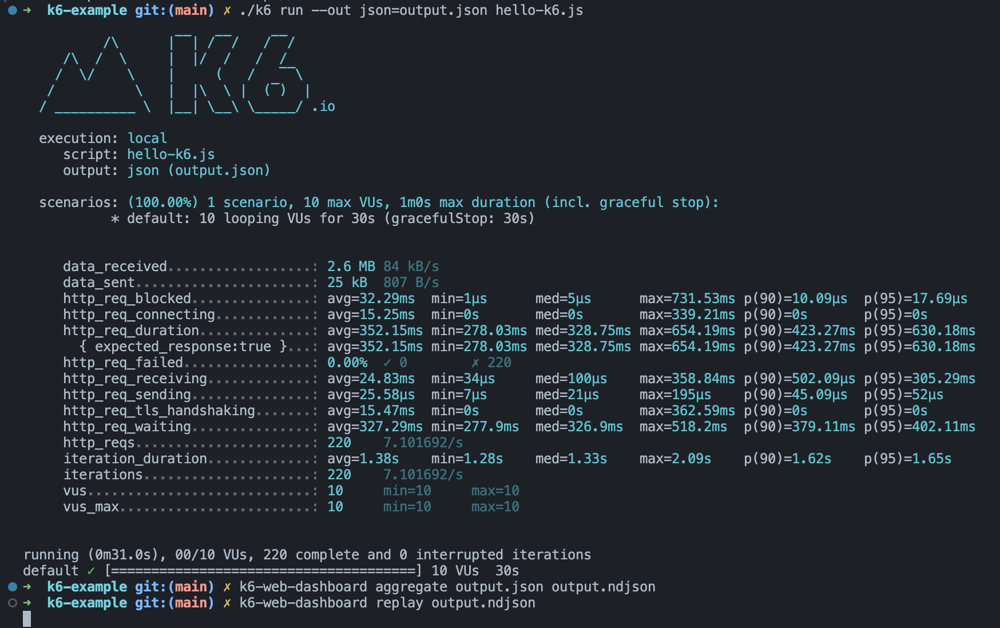
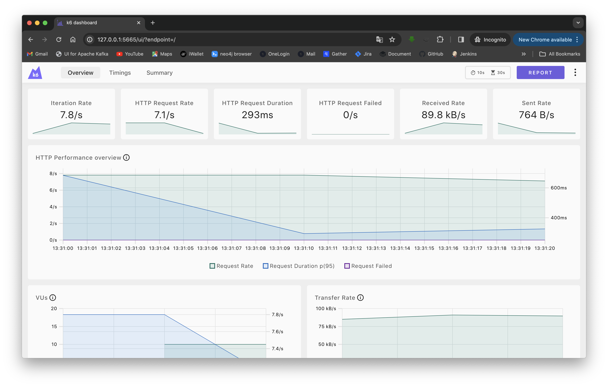

# k6s example

> ตัวอย่างการเขียน/ใช้งาน k6s

# วิธีการใช้งาน k6s

ในตัวอย่างนี้จะใช้งานบนเครื่อง Mac นะครับ ถ้าอยากใช้งานกับ OS อื่น ๆ ให้อ่านที่เอกสาร [Installation](https://k6.io/docs/get-started/installation/) ของ k6s

1. การติดตั้ง/Installation

```sh
$ brew install go
$ brew install k6
```

3. Check version

```sh
$ k6 --version
# k6 v0.48.0 (go1.21.6, darwin/amd64)
```

2. Create sample script

```sh
# Command format
# k6 new <script-name.js>

$ k6 new hello-k6s.js
```

3. Run

```sh
$ k6 run hello-k6s.js
```



4. การ Run ผ่าน Docker 

```sh
$ docker run -v $(pwd):/script --rm -i grafana/k6 run /script/hello-k6s.js 
```



# Dashboard

1. Install xk6

> This command line tool and associated Go package makes it easy to make custom builds of k6. -- [Document](https://github.com/grafana/xk6)

```sh
$ go install go.k6.io/xk6/cmd/xk6@latest
```

2. Intall dashboard

```sh
$ xk6 build --with github.com/grafana/xk6-dashboard@latest
```

ถ้า run แล้วได้ error `command not found: xk6` ให้ลอง run command นี้ดู แล้วค่อย run คำสั่งด้านบนอีกที

```sh
export PATH=$(go env GOPATH)/bin:$PATH
```



เมื่อ run เสร็จ จะได้ไฟล์ k6 มาแบบนี้



ให้ใช้ k6 นี้ run dashboard แทนตัว global command 

3. Run  

ใช้ `./k6` แทน `k6`

```sh
$ ./k6 run --out web-dashboard hello-k6s.js
```




4. เปิดดู Dashboard    

ต้องเปิดในขณะที่ Command ยัง run ไม่เสร็จ ถึงจะเปิดได้ เพราะมันต้องดูแบบ realtime เท่านั้น



### การ ดู Dashboard แบบไม่ realtime  

จะต้อง run k6s แล้ว save result เป็น `.json` ไว้ แล้วค่อยเอามาเปิดผ่าน dashbaord อีกที 

5. Run (Save output เป็น .json)

```sh
$ ./k6 run --out json=output.json hello-k6s.js
```

6. Install **k6-web-dashboard**

> The k6-web-dashboard is a command-line tool that enables the dashboard event file (saved during the previous k6 run) to be played back (and displayed in a browser). In addition to playback, it also offers the possibility to create a single file HTML report from the event file.

```sh
$ go install github.com/grafana/xk6-dashboard/cmd/k6-web-dashboard@latest
```

7. แปลง `.json` ไปเป็น `.ndjson` (Web Dashboard support .ndjson)

```sh
$ k6-web-dashboard aggregate output.json output.ndjson
```

8. Run/Replay dashboard ผ่าน .ndjson

```sh
$ k6-web-dashboard replay output.ndjson
```




